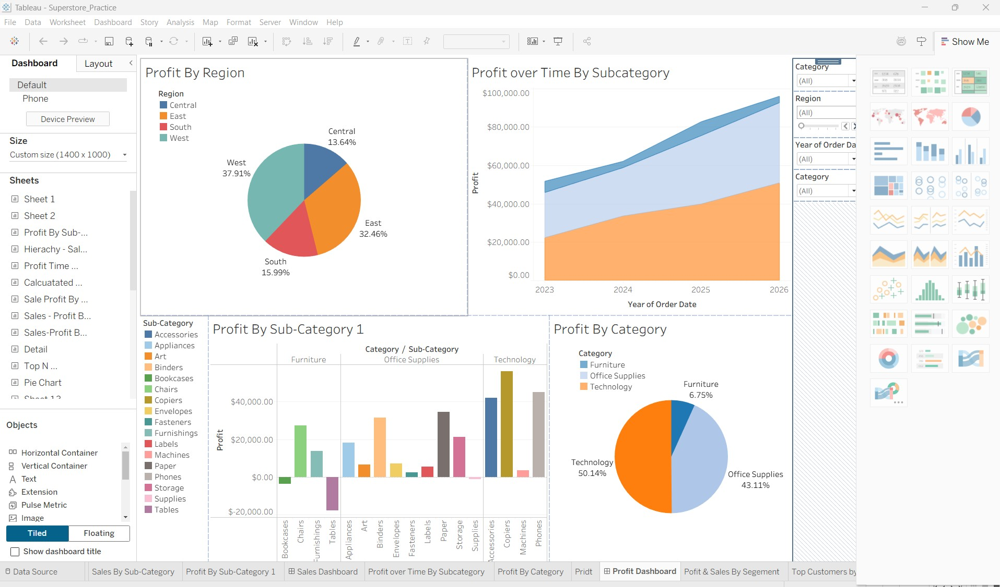

# Tableau Business Dashboard

## Executive Summary
This interactive Tableau dashboard provides a comprehensive analysis of profitability across regions, categories, sub-categories, and time periods using the Superstore dataset.

## Business Problem
Organizations need visibility into profit performance across different regions and product categories. This dashboard helps identify profitable areas, monitor trends, and support data-driven decisions.

## Dashboard Overview

The dashboard includes:

- Profit by Region
- Profit over Time by Sub-Category
- Profit by Sub-Category
- Profit by Category
- Interactive filters for Region, Category, and Year

## Key Insights

- Technology contributes approximately 50% of total profit.
- The West region generates the highest profit.
- Profit has steadily increased over time.
- Some sub-categories outperform others and can be prioritized.

## Recommendations

- Focus on high-performing Technology products.
- Expand successful strategies in the West region.
- Investigate lower-performing regions and categories.
- Use trend analysis to support future planning.

## Tools Used

- Tableau Desktop
- Microsoft Excel
- Data Visualization
- Business Intelligence
- KPI Reporting

## Dataset

Sample Superstore Dataset

## Dashboard Preview

## Files Included

- Superstore_Practice.twb
- Sample - Superstore 1.xls
- Superstore_Practice.jpg

## Author - Mathew Ogieva
